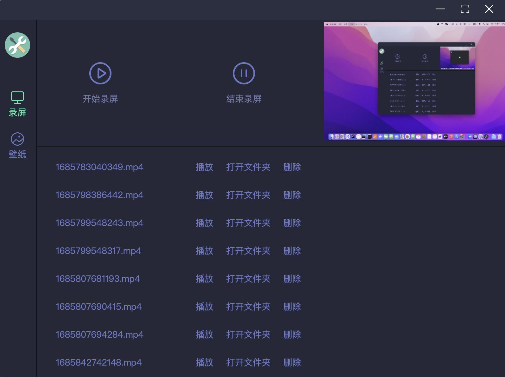

# 8-electron-tools

> Electron + Vue3 + TypeScript + Vite + Pinia + ElementPlus



### 一些单词

```
Electron 电子

process 进程
coordinate 坐标
tray 托盘
factor 因数 系数

clockwise 顺时针
anticlockwise 逆时针
```

### (一) app 模块

```
app
- 作用: 控制应用程序的生命周期
- 进程: 主进程
---

1
生命周期
- ready ---------------------- Electron 完成初始化时，触发出一次
- browser-window-crated ------ 窗口创建完成时触发
- before-quit ---------------- 窗口关闭前触发
- will-quit ------------------ 窗口关闭了 但是程序还没有关闭，即将关闭
- quit ----------------------- 应用程序关闭触发
- requestSingleInstanceLock -- 返回 boolean，应用程序实例是否成功取得了锁，即 ( 禁止双开，配合 second-instance 事件使用 )
```

### (二) BrowserWindow

```
BrowserWindow
- 创建并控制浏览器窗口
```

### (三) 进程通信

```
进程通信
- 主进程
- 渲染进程
---

1
主进程
- 入口: 每个 Electron 应用都有一个单一的主进程，作为应用程序的入口点 ( main.ts )
- 环境: 主进程在 Node.js 环境中运行，这意味着它具有 require 模块和使用所有 Node.js API 的能力
- 主要作用:
  - 主进程的主要目的是使用 BrowserWindow 模块创建和管理应用程序窗口
  - BrowserWindow 类的每个实例创建一个应用程序窗口，且在单独的渲染器进程中加载一个网页

2
渲染进程
- 每个 Electron 应用都会为每个打开的 BrowserWindow ( 与每个网页嵌入 ) 生成一个单独的渲染器进程
- 入口: 以一个 HTML 文件作为渲染器进程的入口点

3
通信
主进程和渲染进程之间的通信
- ipcMain 主进程中的模块
- ipcRender 渲染进程中的模块

扩展
浏览器的五大进程
- 浏览器主进程 ---- 1 个
- 网络进程 ------- 1 个
- GPU 进程 ------- 1 个
- 渲染进程 -------- 多个
- 插件进程 -------- 多个
```
